# Cross-Repo and Cross-Branch Backend Pipeline

## Current state

The backend today analyzes a **single repo, single PR** at a time. The pipeline in [backend/app/worker/tasks.py](backend/app/worker/tasks.py) downloads base/head tarballs for one repo, builds two TS/JS import graphs, diffs them, runs blast radius via reverse BFS, and writes `summary_json` to `pr_analyses`. Phase-2 tables (`dependency_edges`, `branch_drift_signals`, `risk_hotspots`) exist in SQL but are **never populated** by Python code. The `dependency_snapshots` table exists but is unused.

## Architecture overview

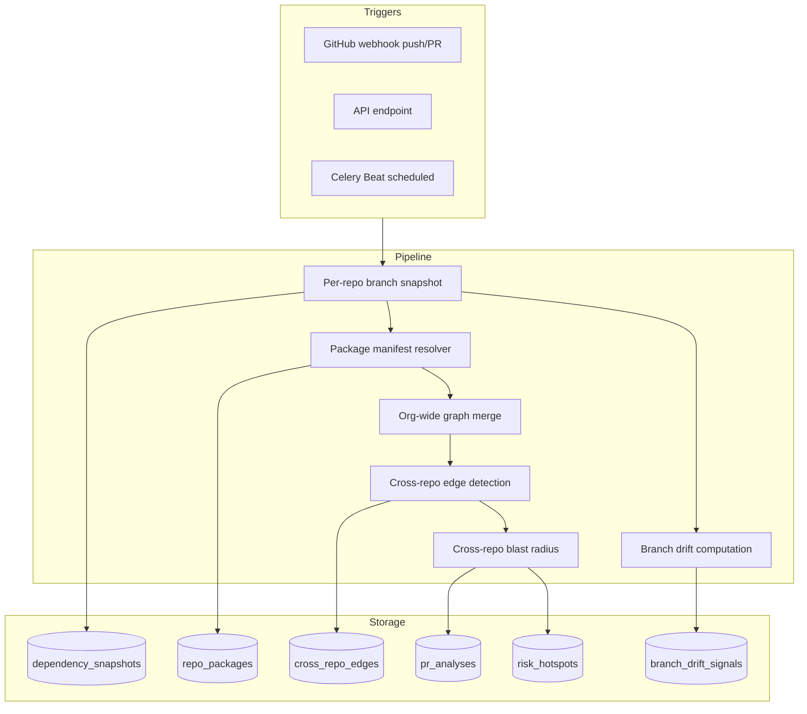

---

## Pipeline Architecture (in-depth)

The system has **three independent pipelines** that share services and storage. Each is triggered differently and produces different outputs, but they feed into each other to create org-wide intelligence.

---

### Pipeline 1: Single-Repo Branch Snapshot

Triggered on every `push` event or API call. This is the foundational pipeline — everything else depends on its outputs.

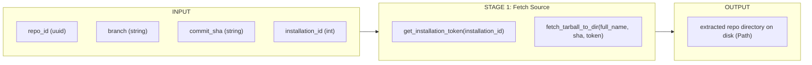

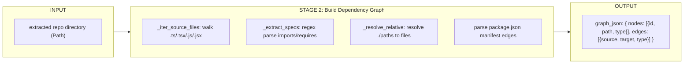

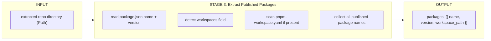

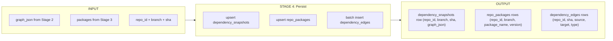

**Full stage-by-stage I/O table:**

- **Stage 1 -- Fetch Source**
  - In: `repo_id`, `branch`, `commit_sha`, `installation_id`
  - Process: JWT sign -> installation token -> GET tarball -> extract to tmpdir
  - Out: `repo_root: Path` (extracted directory on disk)

- **Stage 2 -- Build Dependency Graph**
  - In: `repo_root: Path`
  - Process: walk source files -> regex-parse imports/requires/exports -> resolve relative paths -> parse package.json manifest
  - Out: `graph_json: { nodes: [{id, path, type}], edges: [{source, target, type: "import"|"manifest"}] }`

- **Stage 3 -- Extract Published Packages**
  - In: `repo_root: Path`
  - Process: read root `package.json` `name`+`version` -> detect `workspaces` globs -> walk workspace `package.json` files
  - Out: `packages: [{ name: str, version: str, workspace_path: str | None }]`

- **Stage 4 -- Persist**
  - In: `graph_json`, `packages`, `repo_id`, `branch`, `commit_sha`
  - Process: upsert `dependency_snapshots` -> upsert `repo_packages` -> batch insert `dependency_edges`
  - Out: rows in `dependency_snapshots`, `repo_packages`, `dependency_edges`

---

### Pipeline 2: Cross-Repo Org Graph Build

Triggered when any repo's default branch updates, or on a 6-hour schedule, or via API. Consumes outputs from Pipeline 1.

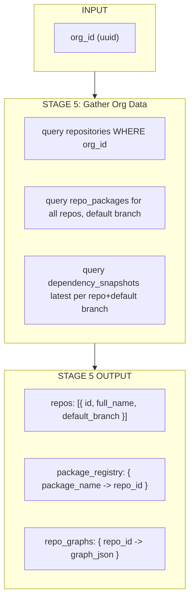

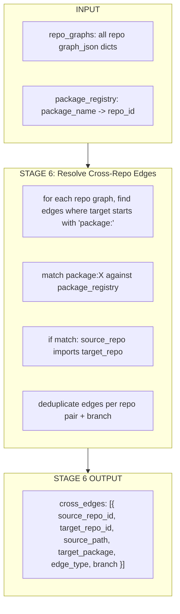

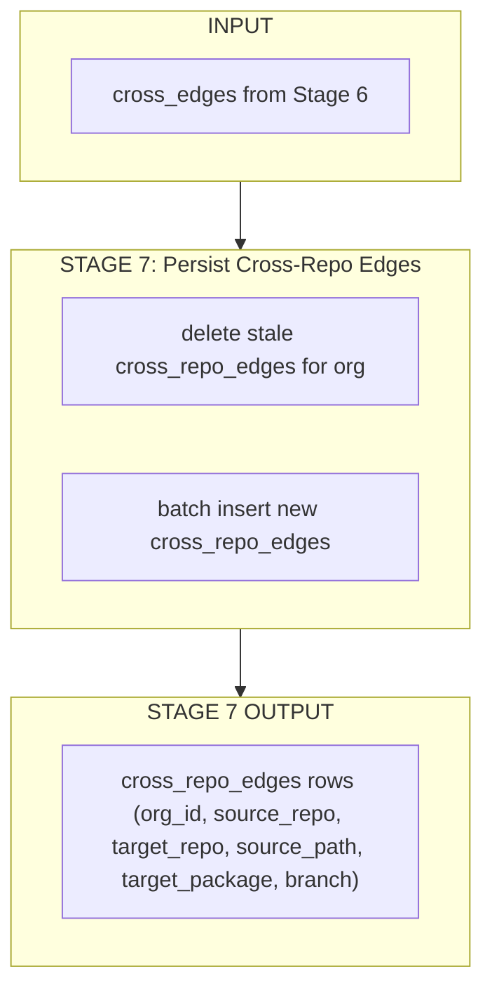

**Full stage-by-stage I/O table:**

- **Stage 5 -- Gather Org Data**
  - In: `org_id`
  - Process: query `repositories` -> query latest `dependency_snapshots` per repo (default branch) -> query `repo_packages`
  - Out: `repos[]`, `package_registry: { package_name: repo_id }`, `repo_graphs: { repo_id: graph_json }`

- **Stage 6 -- Resolve Cross-Repo Edges**
  - In: `repo_graphs`, `package_registry`
  - Process: for each repo's graph edges, find `package:X` targets -> look up X in `package_registry` -> if X maps to another repo, emit a cross-repo edge
  - Out: `cross_edges: [{ source_repo_id, target_repo_id, source_path, target_package, edge_type }]`

- **Stage 7 -- Persist**
  - In: `cross_edges`, `org_id`
  - Process: delete existing `cross_repo_edges` for org -> batch insert new edges
  - Out: rows in `cross_repo_edges`

---

### Pipeline 3: PR Analysis (Single-Repo + Cross-Repo Blast Radius)

Triggered on `pull_request` webhook or `POST /v1/repos/{repo_id}/analyze`. This is the main user-facing pipeline. It runs Pipeline 1 inline for base+head, then optionally extends with cross-repo data from Pipeline 2 outputs.

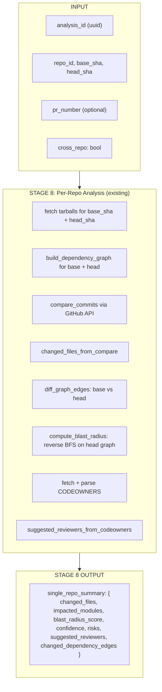

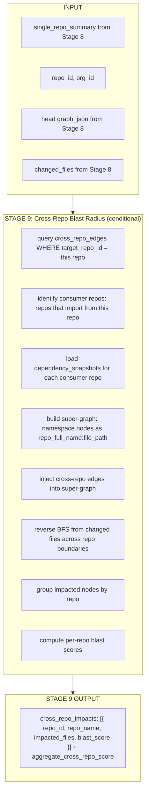

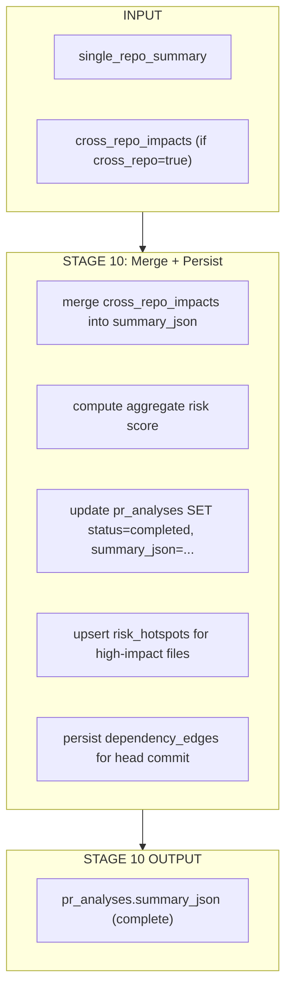

**Full stage-by-stage I/O table:**

- **Stage 8 -- Per-Repo Analysis** (existing pipeline, unchanged)
  - In: `analysis_id`, `repo_id`, `base_sha`, `head_sha`
  - Process: tarballs -> graphs -> compare -> blast radius -> CODEOWNERS -> reviewers
  - Out: `single_repo_summary` dict (same schema as today's `summary_json`)

- **Stage 9 -- Cross-Repo Blast Radius** (new, conditional on `cross_repo=true` or org has cross-repo edges)
  - In: `repo_id`, `org_id`, `head_graph_json`, `changed_files`, `single_repo_summary`
  - Process:
    1. Query `cross_repo_edges WHERE target_repo_id = this_repo` -- find repos that depend on this one
    2. Load `dependency_snapshots` for each consumer repo (latest default-branch snapshot)
    3. Build NetworkX super-graph: each node namespaced as `{repo_full_name}:{file_path}`
    4. Add cross-repo edges connecting consumer files to this repo's files (through package imports)
    5. Reverse BFS from `{this_repo}:{changed_file}` seeds, traversing both intra-repo and cross-repo edges
    6. Group impacted nodes by repo, compute per-repo depth-weighted score
  - Out: `cross_repo_impacts: [{ repo_id, repo_name, impacted_files: [], blast_score: int }]`, `aggregate_cross_repo_score: int`

- **Stage 10 -- Merge and Persist**
  - In: `single_repo_summary`, `cross_repo_impacts`
  - Process: merge into final `summary_json` -> update `pr_analyses` -> upsert `risk_hotspots`
  - Out: completed `pr_analyses` row with full `summary_json`

**Final `summary_json` schema (v2):**

```json
{
  "schema_version": 2,
  "changed_files": ["src/api.ts", "src/utils.ts"],
  "changed_dependency_edges": [
    {"source": "src/api.ts", "target": "src/utils.ts", "type": "import", "change": "added"}
  ],
  "impacted_modules": ["src/api.ts", "src/utils.ts", "src/handler.ts"],
  "blast_radius_score": 42,
  "confidence": "medium",
  "suggested_reviewers": ["alice", "bob"],
  "risks": ["2 new dependency edge(s)"],
  "cross_repo_impacts": [
    {
      "repo_id": "uuid-of-repo-B",
      "repo_name": "org/frontend-app",
      "impacted_files": ["src/client.ts", "src/hooks/useApi.ts"],
      "blast_score": 28
    }
  ],
  "aggregate_cross_repo_score": 28
}
```

---

### Pipeline 4: Branch Drift Detection

Triggered on `push` to non-default branch, scheduled every 6 hours, or via API. Consumes Pipeline 1 snapshots.

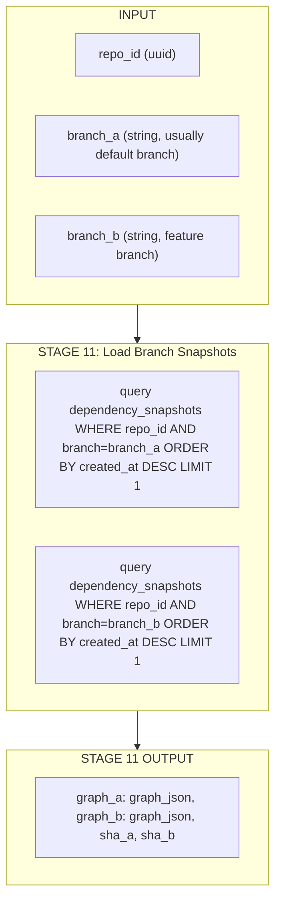

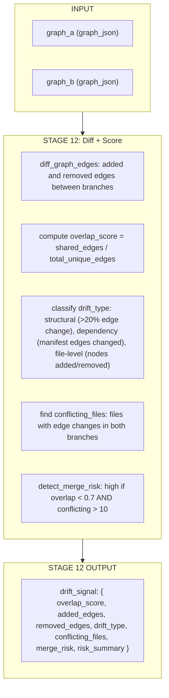

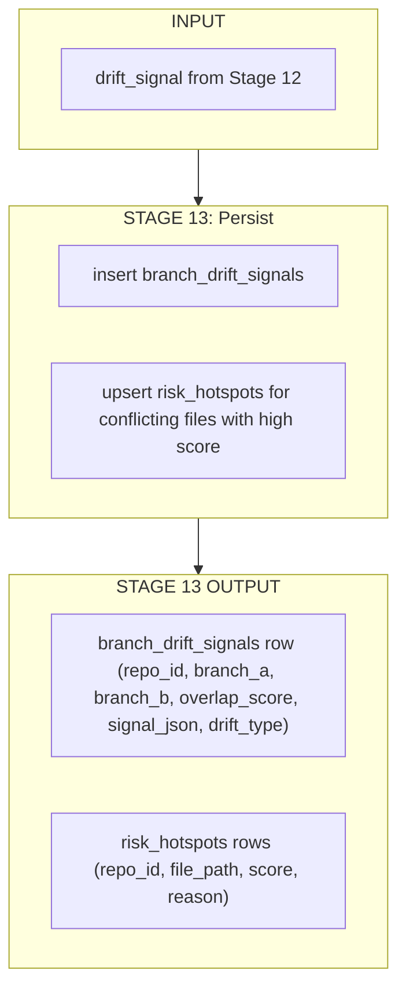

**Full stage-by-stage I/O table:**

- **Stage 11 -- Load Branch Snapshots**
  - In: `repo_id`, `branch_a`, `branch_b`
  - Process: query latest `dependency_snapshots` for each branch
  - Out: `graph_a`, `graph_b`, `sha_a`, `sha_b`

- **Stage 12 -- Diff and Score**
  - In: `graph_a`, `graph_b`
  - Process: `diff_graph_edges` -> overlap ratio -> drift classification -> conflicting file detection -> merge risk heuristic
  - Out: `drift_signal: { overlap_score: float, added_edges: [], removed_edges: [], drift_type: str, conflicting_files: [], merge_risk: "low"|"medium"|"high", risk_summary: str }`

- **Stage 13 -- Persist**
  - In: `drift_signal`, `repo_id`, `branch_a`, `branch_b`
  - Process: insert `branch_drift_signals` -> upsert `risk_hotspots` for conflicting files
  - Out: rows in `branch_drift_signals`, `risk_hotspots`

**`branch_drift_signals.signal_json` schema:**

```json
{
  "overlap_score": 0.82,
  "added_edges": [
    {"source": "src/new-module.ts", "target": "src/utils.ts", "type": "import"}
  ],
  "removed_edges": [],
  "drift_type": "structural",
  "conflicting_files": ["src/utils.ts", "src/api.ts"],
  "merge_risk": "medium",
  "risk_summary": "Feature branch diverged from main: 18% edge difference, 2 files with conflicting structural changes"
}
```

---

### How the pipelines connect

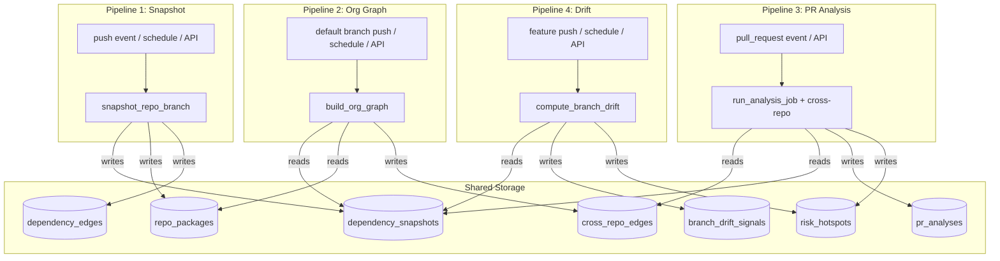

**Dependency order:**
- Pipeline 1 must run first (produces snapshots and package data)
- Pipeline 2 depends on Pipeline 1 outputs (reads snapshots + packages to build cross-repo edges)
- Pipeline 3 depends on Pipeline 2 outputs for cross-repo analysis (reads cross_repo_edges), but falls back to single-repo-only if no edges exist
- Pipeline 4 depends on Pipeline 1 outputs (reads branch snapshots to diff)

---

## Graph Intelligence Architecture (Greptile-Inspired Full ML Stack)

The system replaces the current regex file-level graph with a six-layer intelligence stack: tree-sitter AST parsing, LLM-based semantic embeddings, a GAT+GraphSAGE graph neural network, vector-indexed retrieval, attention-weighted blast radius, and an RLHF feedback loop. Each layer has explicit inputs, processing, and outputs.

### Full-stack overview

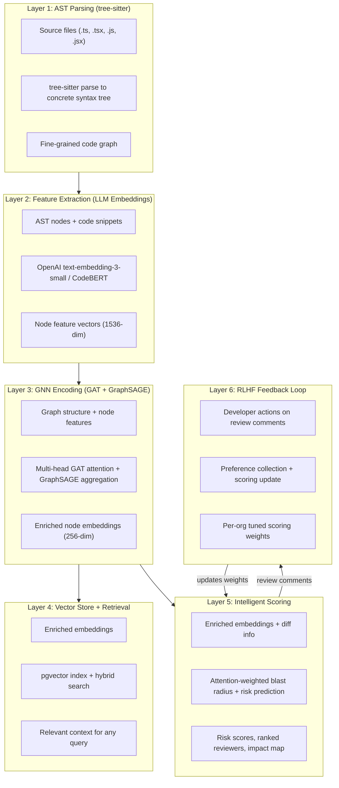

---

### Layer 1: AST Parsing (tree-sitter)

Replaces the current regex-based `graph_builder.py` with production-grade tree-sitter parsing. Produces a fine-grained graph where nodes are individual code constructs (not whole files).

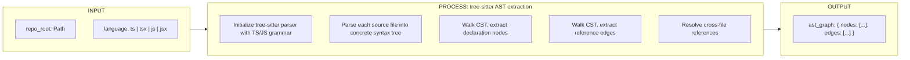

**Node types extracted:**

- `function_declaration` / `arrow_function` / `method_definition` -- id: `file:line:name`
- `class_declaration` / `interface_declaration` / `type_alias_declaration`
- `variable_declarator` (for exported constants, configs)
- `import_statement` (the import itself as a node, connecting file to dependency)
- `export_statement` (marks a symbol as a public API surface)

**Edge types extracted:**

- `imports` -- file A imports symbol from file B
- `calls` -- function A calls function B (via `call_expression` AST node)
- `extends` -- class A extends class B
- `implements` -- class A implements interface B
- `type_reference` -- function/variable references a type from another file
- `exports` -- module re-exports from another module

**I/O specification:**

- In: `repo_root: Path` (extracted tarball directory)
- Process:
  1. `tree_sitter.Parser()` with `tree_sitter_typescript.language()` or `tree_sitter_javascript.language()`
  2. For each `.ts/.tsx/.js/.jsx` file: `parser.parse(source_bytes)` -> walk `tree.root_node`
  3. Visitor extracts declarations (`function_declaration`, `class_declaration`, `interface_declaration`, `variable_declarator`) -> each becomes a node with `{id: "file.ts:42:functionName", kind: "function", name: "functionName", file: "file.ts", line: 42, code_snippet: "first 5 lines of body"}`
  4. Visitor extracts references (`call_expression`, `new_expression`, `type_annotation`) -> each becomes an edge
  5. Import/export resolution links cross-file references
- Out: `ast_graph_json`:

```json
{
  "nodes": [
    {
      "id": "src/api.ts:15:fetchUser",
      "kind": "function",
      "name": "fetchUser",
      "file": "src/api.ts",
      "line": 15,
      "code_snippet": "async function fetchUser(id: string): Promise<User> {",
      "exports": true
    },
    {
      "id": "src/api.ts:1:import_httpx",
      "kind": "import",
      "name": "httpx",
      "file": "src/api.ts",
      "line": 1,
      "target_module": "httpx"
    }
  ],
  "edges": [
    {
      "source": "src/handler.ts:10:handleRequest",
      "target": "src/api.ts:15:fetchUser",
      "type": "calls",
      "source_file": "src/handler.ts",
      "target_file": "src/api.ts"
    },
    {
      "source": "src/models.ts:5:AdminUser",
      "target": "src/models.ts:1:User",
      "type": "extends"
    }
  ],
  "file_count": 42,
  "node_count": 387,
  "edge_count": 1204
}
```

**Dependencies:** `tree-sitter>=0.24`, `tree-sitter-typescript>=0.24`, `tree-sitter-javascript>=0.24`

**New file:** `backend/app/services/ast_parser.py`

---

### Layer 2: Feature Extraction (LLM Semantic Embeddings)

Each AST node gets a semantic embedding vector that captures what the code does, not just its name. This enables similarity search and provides input features for the GNN.

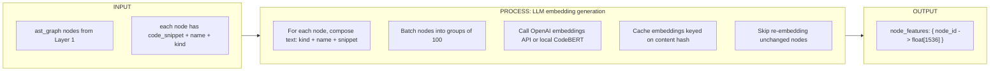

**I/O specification:**

- In: `ast_graph_json.nodes[]` -- each node with `kind`, `name`, `code_snippet`, `file`, `line`
- Process:
  1. For each node, compose embedding text: `"{kind} {name} in {file}: {code_snippet}"` (truncated to 512 tokens)
  2. Content-hash the text; skip if embedding already cached in `node_embeddings` table
  3. Batch uncached texts into groups of 100
  4. Call `openai.embeddings.create(model="text-embedding-3-small", input=batch)` -> 1536-dim vectors
  5. Fallback: local `sentence-transformers` with `microsoft/codebert-base` (768-dim) when OpenAI unavailable
  6. Store vectors in `node_embeddings` table (pgvector)
- Out: `node_features: dict[str, list[float]]` mapping node IDs to embedding vectors

**Embedding text template:**

```
function fetchUser in src/api.ts:
async function fetchUser(id: string): Promise<User> {
  const response = await httpClient.get(`/users/${id}`);
  return response.data;
}
```

**Cost estimate:** ~$0.02 per 1M tokens at `text-embedding-3-small` pricing. A 500-file repo with ~2000 AST nodes at ~50 tokens each = ~100K tokens = ~$0.002 per full repo embedding.

**Dependencies:** `openai>=1.0` (already available via httpx), optionally `sentence-transformers` + `torch` for local fallback

**New file:** `backend/app/services/embedding_engine.py`

---

### Layer 3: GNN Encoding (GAT + GraphSAGE Hybrid)

The core ML model. Takes the code graph structure + node feature vectors and produces enriched embeddings that encode each node's structural context (what calls it, what it depends on, how central it is).

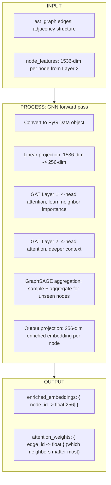

**Architecture detail:**

```
Input: X (N x 1536), edge_index (2 x E)
  |
  v
Linear(1536 -> 256)  -- dimensionality reduction
  |
  v
GATConv(256 -> 64, heads=4)  -- multi-head attention layer 1
  |  output: N x 256 (64 * 4 heads concatenated)
  |  attention coefficients: alpha_ij for each edge
  v
ELU activation + dropout(0.3)
  |
  v
GATConv(256 -> 64, heads=4)  -- attention layer 2
  |  output: N x 256
  v
ELU activation + dropout(0.3)
  |
  v
SAGEConv(256 -> 256, aggr='mean')  -- GraphSAGE aggregation
  |  enables inductive inference on unseen code
  v
Output: enriched_embeddings (N x 256)
       + attention_weights (E floats)
```

**GAT attention mechanism (per edge i->j):**

```
e_ij = LeakyReLU(a^T [W*h_i || W*h_j])
alpha_ij = softmax_j(e_ij)         -- normalize over all neighbors of i
h_i' = sigma(SUM_j alpha_ij * W * h_j)  -- weighted neighbor aggregation
```

The attention weights `alpha_ij` tell us: "when analyzing node i, how much does neighbor j matter?" This directly feeds into blast radius -- high-attention edges propagate more risk.

**GraphSAGE layer purpose:** GAT alone is transductive (needs all nodes at training time). The GraphSAGE layer enables **inductive inference** -- the model can process new code files, new functions, and new repos it has never seen before, by sampling and aggregating neighbor features.

**Training strategy:**

- **Self-supervised pre-training**: Link prediction task -- mask 15% of edges, train the model to predict whether two nodes are connected. No labeled data needed.
- **Fine-tuning with feedback** (Layer 6): When developer feedback accumulates, fine-tune on preference pairs (comments that were addressed vs dismissed).
- **Training data**: All org repos' AST graphs serve as training graphs. Model trains periodically (nightly Celery Beat task) when new snapshots accumulate.

**I/O specification:**

- In:
  - `edge_index: Tensor[2, E]` -- graph adjacency from AST edges
  - `node_features: Tensor[N, 1536]` -- from Layer 2
  - `edge_type: Tensor[E]` -- categorical (imports=0, calls=1, extends=2, ...)
- Process: PyTorch Geometric forward pass through the architecture above
- Out:
  - `enriched_embeddings: Tensor[N, 256]` -- each node now encodes its structural neighborhood
  - `attention_weights: Tensor[E]` -- per-edge importance score (averaged over heads)

**Inference mode:** For new PRs, run a single forward pass on the head graph (takes <1s for graphs under 10K nodes on CPU). No GPU required for inference.

**Dependencies:** `torch>=2.0`, `torch-geometric>=2.5` (PyG), `torch-scatter`, `torch-sparse`

**New file:** `backend/app/services/gnn_engine.py`

**Model artifacts:** Saved to `model_artifacts` table (serialized state_dict as bytea) and loaded by the worker on startup.

---

### Layer 4: Vector Store + Hybrid Retrieval

Enriched embeddings are indexed in pgvector for similarity search. The retrieval layer combines three strategies (like Greptile): vector similarity, keyword search, and agentic graph walk.

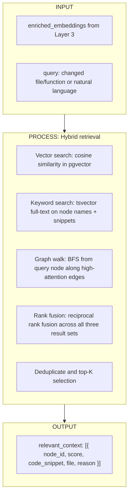

**I/O specification:**

- In:
  - `query_embedding: float[256]` -- embedding of the changed function/file (from Layer 3) or a natural language question embedded via Layer 2
  - `repo_id` (or `org_id` for cross-repo)
  - `top_k: int` (default 20)
- Process:
  1. **Vector search**: `SELECT * FROM node_embeddings ORDER BY embedding <=> query_embedding LIMIT top_k` (pgvector cosine distance)
  2. **Keyword search**: `SELECT * FROM node_embeddings WHERE search_text @@ plainto_tsquery(query_text) LIMIT top_k`
  3. **Graph walk**: BFS from query node along edges where `attention_weight > 0.3`, up to depth 3
  4. **Reciprocal Rank Fusion**: `score(d) = SUM(1 / (k + rank_in_method))` across all three methods
  5. Return top K after fusion
- Out: `relevant_context: list[{ node_id, similarity_score, code_snippet, file, line, retrieval_reason }]`

**Use cases for retrieval:**
- Blast radius: "given this changed function, what else in the org is semantically related?"
- Reviewer routing: "who owns code similar to this change?"
- Risk prediction: "what past changes to similar code caused issues?"

**Database requirements:** pgvector extension enabled in Supabase (`CREATE EXTENSION vector`)

**New file:** `backend/app/services/vector_store.py`

---

### Layer 5: Intelligent Scoring (Attention-Weighted Analysis)

Replaces the current uniform reverse-BFS with attention-weighted traversal. Edges with higher GAT attention propagate more blast radius. GNN-enriched embeddings improve risk prediction.

```mermaid
flowchart TD
  subgraph L5input [INPUT]
    L5I1["enriched_embeddings from Layer 3"]
    L5I2["attention_weights from Layer 3"]
    L5I3["changed_files / changed_nodes from PR diff"]
    L5I4["org_scoring_weights from Layer 6 (RLHF)"]
  end

  subgraph L5process ["PROCESS: Intelligent blast radius"]
    L5P1["Seed: changed AST nodes in the diff"]
    L5P2["Weighted reverse BFS: propagate risk along edges, scaled by attention_weight"]
    L5P3["Risk accumulation: deeper nodes get discounted, low-attention edges get discounted more"]
    L5P4["Cross-repo propagation: follow cross_repo_edges with their own attention weights"]
    L5P5["Anomaly detection: flag nodes whose enriched embedding shifted significantly between base and head"]
    L5P6["Reviewer ranking: cosine similarity between changed-node embeddings and developer-owned-code embeddings"]
  end

  subgraph L5output [OUTPUT]
    L5O1["blast_radius_v3: { score, impacted_nodes: [{id, risk, depth, attention}], cross_repo_impacts }"]
    L5O2["risk_anomalies: nodes with high embedding drift"]
    L5O3["ranked_reviewers: [{ handle, relevance_score, owned_impacted_files }]"]
  end

  L5input --> L5process --> L5output
```

**Attention-weighted BFS (replaces uniform BFS):**

```
For each seed node s in changed_nodes:
  queue = [(s, depth=0, risk=1.0)]
  while queue:
    node, d, r = queue.pop()
    if d >= max_depth: continue
    for predecessor p of node:
      edge_attention = attention_weights[(p, node)]  -- from GAT
      propagated_risk = r * edge_attention * decay_factor(d)
      if propagated_risk > threshold:
        mark p as impacted with accumulated risk
        queue.append((p, d+1, propagated_risk))
```

This means: a function that the GAT learned is tightly coupled (high attention) propagates more risk than a loosely connected utility function. The current uniform BFS treats all edges equally.

**Embedding drift detection:**

```
For each node in head graph:
  if node existed in base graph:
    drift = cosine_distance(base_embedding[node], head_embedding[node])
    if drift > 0.3:  -- significant semantic change
      flag as risk_anomaly even if node itself wasn't in the diff
```

This catches: renamed functions, changed return types, altered control flow -- things that change semantics without appearing in the simple file diff.

**I/O specification:**

- In:
  - `enriched_embeddings`: from Layer 3 for both base and head graphs
  - `attention_weights`: from Layer 3 for head graph
  - `changed_nodes`: AST nodes that appear in the PR diff
  - `org_scoring_weights`: learned adjustments from RLHF (default: uniform)
- Out:
  - `blast_radius_v3`: enhanced blast radius with per-node attention scores
  - `risk_anomalies`: nodes whose embeddings shifted even if not in diff
  - `ranked_reviewers`: reviewers ranked by semantic relevance, not just CODEOWNERS pattern match

**New file:** `backend/app/services/intelligent_scorer.py`

---

### Layer 6: RLHF Feedback Loop

Developer actions (resolve, dismiss, thumbs-up/down) on review comments feed back into the scoring model. Per-org isolation ensures team-specific patterns are learned.

```mermaid
flowchart TD
  subgraph L6input [INPUT]
    L6I1["review_comment_id"]
    L6I2["action: addressed | dismissed | thumbs_up | thumbs_down"]
    L6I3["org_id (for isolation)"]
  end

  subgraph L6process ["PROCESS: Feedback collection + model update"]
    L6P1["Store feedback in review_feedback table"]
    L6P2["Accumulate preference pairs: (addressed_comment, dismissed_comment)"]
    L6P3["When pairs >= 50: trigger scoring weight update"]
    L6P4["Compute edge-type importance weights per org"]
    L6P5["Adjust attention thresholds and decay factors"]
    L6P6["Serialize updated weights to model_artifacts"]
  end

  subgraph L6output [OUTPUT]
    L6O1["org_scoring_weights: { edge_type_weights, attention_threshold, decay_factor }"]
    L6O2["feedback_stats: { total, addressed_rate, false_positive_rate }"]
  end

  L6input --> L6process --> L6output
```

**I/O specification:**

- In:
  - `review_comment_id`, `analysis_id`, `org_id`
  - `action`: one of `addressed` (developer made a code change matching the suggestion), `dismissed` (developer resolved without changing), `thumbs_up`, `thumbs_down`
- Process:
  1. Insert into `review_feedback` table
  2. Periodically (Celery Beat, daily) aggregate feedback per org
  3. Compute preference signals: comments that were `addressed` are "good" predictions; `dismissed` or `thumbs_down` are "bad"
  4. Update `org_scoring_weights`:
     - Increase weight for edge types whose traversal produced `addressed` comments
     - Decrease weight for edge types that produced `dismissed` comments
     - Adjust `attention_threshold` (prune low-value edges) and `decay_factor` (how quickly risk drops with depth)
  5. Serialize to `model_artifacts` table; worker loads updated weights on next analysis
- Out: `org_scoring_weights` dict used by Layer 5

**Feedback table schema:**

```json
{
  "id": "uuid",
  "org_id": "uuid",
  "analysis_id": "uuid",
  "comment_node_id": "src/api.ts:15:fetchUser",
  "comment_type": "blast_radius | risk_anomaly | reviewer_suggestion",
  "action": "addressed | dismissed | thumbs_up | thumbs_down",
  "created_at": "timestamp"
}
```

**Privacy:** All feedback is org-scoped. One org's feedback never influences another org's scoring. Model weights are stored per-org in `model_artifacts`.

**New files:** `backend/app/services/feedback_engine.py`, `backend/app/routers/feedback.py`

---

### End-to-end: PR analysis with full ML stack

```mermaid
sequenceDiagram
  participant GH as GitHub
  participant API as FastAPI
  participant W as Celery Worker
  participant TS as tree-sitter
  participant LLM as OpenAI Embeddings
  participant GNN as GAT+GraphSAGE
  participant PGV as pgvector
  participant DB as Supabase

  GH->>API: pull_request webhook
  API->>DB: insert pr_analyses (pending)
  API->>W: schedule run_analysis_job

  Note over W: Stage 1 - Fetch
  W->>GH: fetch tarballs (base + head)

  Note over W: Stage 2 - AST Parse (Layer 1)
  W->>TS: parse base files
  TS-->>W: base_ast_graph (nodes: functions/classes, edges: calls/imports)
  W->>TS: parse head files
  TS-->>W: head_ast_graph

  Note over W: Stage 3 - Embed (Layer 2)
  W->>DB: check node_embeddings cache (content hashes)
  DB-->>W: cached embeddings for unchanged nodes
  W->>LLM: embed new/changed nodes (batched)
  LLM-->>W: feature vectors (1536-dim per node)

  Note over W: Stage 4 - GNN Encode (Layer 3)
  W->>DB: load model weights from model_artifacts
  W->>GNN: forward pass (head_ast_graph + features)
  GNN-->>W: enriched_embeddings (256-dim) + attention_weights

  Note over W: Stage 5 - Intelligent Scoring (Layer 5)
  W->>DB: load org_scoring_weights
  W->>W: attention-weighted reverse BFS from changed nodes
  W->>W: embedding drift detection (base vs head)
  W->>W: reviewer ranking by embedding similarity

  Note over W: Stage 6 - Cross-Repo (if applicable)
  W->>DB: load cross_repo_edges for this repo
  W->>DB: load consumer repo snapshots
  W->>W: cross-repo attention-weighted blast radius

  Note over W: Stage 7 - Store
  W->>PGV: upsert enriched embeddings
  W->>DB: update pr_analyses with summary_json v3
  W->>DB: upsert risk_hotspots
```

### Final `summary_json` schema (v3, with ML scoring):

```json
{
  "schema_version": 3,
  "changed_files": ["src/api.ts"],
  "changed_nodes": [
    {"id": "src/api.ts:15:fetchUser", "kind": "function", "change": "modified"}
  ],
  "changed_dependency_edges": [
    {"source": "src/api.ts:15:fetchUser", "target": "src/db.ts:8:query", "type": "calls", "change": "added"}
  ],
  "impacted_modules": [
    {"id": "src/handler.ts:10:handleRequest", "risk": 0.87, "depth": 1, "attention": 0.92},
    {"id": "src/router.ts:5:routeRequest", "risk": 0.41, "depth": 2, "attention": 0.65}
  ],
  "blast_radius_score": 67,
  "confidence": "high",
  "risk_anomalies": [
    {"id": "src/utils.ts:3:formatDate", "embedding_drift": 0.42, "reason": "Return type changed from string to Date"}
  ],
  "suggested_reviewers": [
    {"handle": "alice", "relevance_score": 0.94, "reason": "Owns 3 impacted files, high embedding similarity"},
    {"handle": "bob", "relevance_score": 0.71, "reason": "CODEOWNERS match + similar code patterns"}
  ],
  "risks": ["High coupling: fetchUser has 12 direct callers", "Embedding drift in formatDate suggests semantic change"],
  "cross_repo_impacts": [
    {
      "repo_id": "uuid",
      "repo_name": "org/frontend-app",
      "impacted_nodes": [
        {"id": "src/client.ts:20:apiCall", "risk": 0.63, "attention": 0.78}
      ],
      "blast_score": 35
    }
  ],
  "aggregate_cross_repo_score": 35,
  "ml_metadata": {
    "model_version": "gat-sage-v1.2",
    "embedding_model": "text-embedding-3-small",
    "node_count": 387,
    "edge_count": 1204,
    "inference_ms": 340
  }
}
```

---

### ML infrastructure requirements

**New dependencies** (add to `pyproject.toml`):

- `tree-sitter>=0.24`
- `tree-sitter-typescript>=0.24`
- `tree-sitter-javascript>=0.24`
- `torch>=2.0`
- `torch-geometric>=2.5`
- `openai>=1.0` (for embeddings API)
- `sentence-transformers>=3.0` (optional local fallback)

**New database tables** (migration `20250415000001_ml_stack.sql`):

- `ast_graph_snapshots` -- stores AST-level graphs per repo+branch+sha (finer than file-level `dependency_snapshots`)
- `node_embeddings` -- `node_id text, repo_id uuid, embedding vector(256), content_hash text, search_text tsvector, created_at timestamptz`
- `review_feedback` -- `org_id, analysis_id, comment_node_id, comment_type, action, created_at`
- `model_artifacts` -- `org_id, model_name, version, state_dict bytea, metrics jsonb, created_at`

**Supabase extension:** `CREATE EXTENSION IF NOT EXISTS vector` (pgvector for similarity search)

**Docker Compose additions:**
- Worker needs `torch` installed (CPU-only for inference; GPU optional for training)
- Celery Beat process for periodic model retraining and embedding refresh

**New files:**

- `backend/app/services/ast_parser.py` -- tree-sitter parsing (Layer 1)
- `backend/app/services/embedding_engine.py` -- LLM embedding generation (Layer 2)
- `backend/app/services/gnn_engine.py` -- PyTorch Geometric GAT+GraphSAGE model (Layer 3)
- `backend/app/services/vector_store.py` -- pgvector hybrid retrieval (Layer 4)
- `backend/app/services/intelligent_scorer.py` -- attention-weighted scoring (Layer 5)
- `backend/app/services/feedback_engine.py` -- RLHF collection + weight updates (Layer 6)
- `backend/app/routers/feedback.py` -- feedback API endpoints
- `backend/app/worker/ml_tasks.py` -- Celery tasks for training, embedding refresh
- `backend/tests/test_ast_parser.py`
- `backend/tests/test_embedding_engine.py`
- `backend/tests/test_gnn_engine.py`
- `backend/tests/test_vector_store.py`
- `backend/tests/test_feedback.py`

---

## Phase 1: Database migration

New file: `supabase/migrations/20250415000000_cross_repo_branches.sql`

**New tables:**

- **`repo_packages`** — maps each repo to the package name(s) it publishes (from `package.json` `name` field):
  - `id`, `repo_id` (FK), `branch`, `package_name`, `package_version`, `updated_at`
  - Unique on `(repo_id, branch, package_name)`

- **`cross_repo_edges`** — cross-repo dependency links:
  - `id`, `org_id` (FK), `source_repo_id` (FK), `target_repo_id` (FK), `source_path`, `target_package`, `edge_type` (`import` | `manifest`), `branch`, `created_at`
  - Index on `(org_id, branch)`

**Extend existing tables:**

- **`dependency_snapshots`**: add `branch text not null default 'main'` column; alter unique constraint to `(repo_id, branch, commit_sha)` — enables per-branch graph caching
- **`branch_drift_signals`**: add `base_sha text`, `head_sha text`, `drift_type text` (structural | file-level | dependency) columns for richer signals

**RLS policies**: select for org members (same pattern as existing tables).

---

## Phase 2: New services

### 2a. `backend/app/services/package_resolver.py`

Resolves cross-repo package dependencies:

- `extract_published_packages(repo_root: Path) -> list[dict]` — reads `package.json` for `name`, `version`; also checks for workspace configs (`workspaces` field, `pnpm-workspace.yaml`) to handle monorepos
- `resolve_cross_repo_edges(org_repos: list[dict], package_registry: dict) -> list[dict]` — for each repo's import graph, matches bare `import 'X'` specifiers against the `repo_packages` table to find intra-org dependencies
- Uses existing `graph_builder._extract_specs()` for import detection

### 2b. `backend/app/services/branch_monitor.py`

Branch drift detection:

- `compare_branch_graphs(graph_a: dict, graph_b: dict) -> dict` — diffs two graphs using existing `diff_graph_edges()`, computes overlap score (shared edges / total edges), and categorizes drift type
- `compute_drift_signals(repo_id, branch_a, branch_b, ...) -> dict` — full pipeline: load snapshots from DB for both branches, diff, score, return `{ overlap_score, added_edges, removed_edges, drift_type, conflicting_files, risk_summary }`
- `detect_merge_risk(drift_signal: dict) -> dict` — heuristic scoring: high risk when overlap < 0.7 and >10 conflicting edge changes

### 2c. Extend `backend/app/services/blast_radius.py`

Add `compute_cross_repo_blast_radius(org_id, changed_repo_id, changed_files, org_graph) -> dict`:

- Build a **super-graph** from all repos' dependency graphs + cross_repo_edges
- Namespace nodes as `{repo_full_name}:{file_path}` to avoid collisions
- Run the same reverse-BFS but across repo boundaries
- Group impacted nodes by repo, return per-repo blast scores + aggregate score
- Add `cross_repo_impacts` field to the existing blast radius output format

### 2d. Extend `backend/app/services/github_client.py`

Add:

- `list_installation_repos(token: str) -> list[dict]` — `GET /installation/repositories` (paginated)
- `list_branches(full_name, token) -> list[dict]` — `GET /repos/{owner}/{repo}/branches`
- `get_branch_head_sha(full_name, branch, token) -> str` — returns HEAD SHA for a branch

---

## Phase 3: New worker tasks

Extend [backend/app/worker/tasks.py](backend/app/worker/tasks.py) and add [backend/app/worker/cross_repo_tasks.py](backend/app/worker/cross_repo_tasks.py):

### 3a. `snapshot_repo_branch(repo_id, branch, sha)`

- Download tarball for `sha`
- Build dependency graph via `build_dependency_graph()`
- Extract published package name via `extract_published_packages()`
- Upsert into `dependency_snapshots` (keyed on `repo_id + branch + sha`)
- Upsert into `repo_packages`
- Upsert edges into `dependency_edges`
- Register as Celery task `dm.snapshot_repo_branch`

### 3b. `build_org_graph(org_id)`

- Fetch all repos for org
- For each repo, load latest `dependency_snapshots` for default branch
- Load `repo_packages` for all repos
- Call `resolve_cross_repo_edges()` to detect inter-repo dependencies
- Store results in `cross_repo_edges`
- Register as Celery task `dm.build_org_graph`

### 3c. `compute_branch_drift(repo_id, branch_a, branch_b)`

- Load graph snapshots for both branches
- Call `compare_branch_graphs()` and `compute_drift_signals()`
- Store result in `branch_drift_signals`
- Update `risk_hotspots` for files appearing in high-drift zones
- Register as Celery task `dm.compute_branch_drift`

### 3d. Enhance existing `run_analysis_job`

After the current per-repo blast radius, add:

- Load org's `cross_repo_edges` where `target_repo_id == this repo`
- If cross-repo consumers exist, compute `compute_cross_repo_blast_radius()`
- Merge `cross_repo_impacts` into `summary_json`
- Persist cross-repo impacted repos to `risk_hotspots`

### 3e. Celery Beat schedule (periodic)

In [backend/app/celery_app.py](backend/app/celery_app.py), add `beat_schedule`:

- `snapshot-all-repos`: every 6 hours, snapshots default branch of all org repos
- `drift-check`: every 6 hours, compares active branches within each repo

---

## Phase 4: New API endpoints

### 4a. `backend/app/routers/cross_repo.py` — prefix `/v1/orgs/{org_id}`

- `POST /graph/build` — triggers `build_org_graph` task; returns `202` with task ID
- `GET /graph` — returns the latest org-wide cross-repo edge map (from `cross_repo_edges`)
- `GET /graph/repos/{repo_id}/consumers` — which repos in the org depend on this repo
- `GET /graph/repos/{repo_id}/dependencies` — which org repos does this repo depend on

### 4b. `backend/app/routers/branches.py` — prefix `/v1/repos/{repo_id}`

- `POST /branches/snapshot` — body: `{ branch, sha }` — triggers `snapshot_repo_branch`; returns `202`
- `POST /branches/drift` — body: `{ branch_a, branch_b }` — triggers drift comparison; returns `202`
- `GET /branches/drift` — returns latest drift signals for the repo
- `GET /branches/{branch}/graph` — returns dependency snapshot for a specific branch

### 4c. Extend existing `POST /v1/repos/{repo_id}/analyze`

Add optional body field `cross_repo: bool = false`. When true, the analysis job also runs cross-repo blast radius.

---

## Phase 5: Webhook enhancements

Extend [backend/app/routers/webhooks.py](backend/app/routers/webhooks.py):

- **`push` event** to default branch: trigger `snapshot_repo_branch` for the pushed branch + `build_org_graph` for the org (rebuilds cross-repo edges when any repo's default branch changes)
- **`push` event** to non-default branch: trigger `snapshot_repo_branch` + `compute_branch_drift` (vs default branch)
- **`create`/`delete` branch events**: trigger drift recalculation or cleanup

---

## Phase 6: Tests

New test files:

- `backend/tests/test_package_resolver.py` — mock package.json with workspace, verify cross-repo edge resolution
- `backend/tests/test_branch_monitor.py` — two graphs with known drift, verify overlap score + drift type
- `backend/tests/test_cross_repo_blast.py` — two-repo graph, change in repo A, verify repo B files appear in blast radius

---

## Key files changed

**New files:**

- `supabase/migrations/20250415000000_cross_repo_branches.sql`
- `backend/app/services/package_resolver.py`
- `backend/app/services/branch_monitor.py`
- `backend/app/worker/cross_repo_tasks.py`
- `backend/app/routers/cross_repo.py`
- `backend/app/routers/branches.py`
- `backend/tests/test_package_resolver.py`
- `backend/tests/test_branch_monitor.py`
- `backend/tests/test_cross_repo_blast.py`

**Modified files:**

- `backend/app/services/blast_radius.py` — add `compute_cross_repo_blast_radius()`
- `backend/app/services/github_client.py` — add `list_installation_repos()`, `list_branches()`, `get_branch_head_sha()`
- `backend/app/worker/tasks.py` — enhance `run_analysis_job` with cross-repo step
- `backend/app/celery_app.py` — register new tasks + beat schedule
- `backend/app/main.py` — mount new routers
- `backend/app/routers/webhooks.py` — handle `push`, `create`, `delete` events
- `backend/app/routers/analyses.py` — add `cross_repo` option
- `.github/workflows/ci.yml` — add new test files to pytest

## Data flow: cross-repo blast radius on PR

```mermaid
sequenceDiagram
  participant GH as GitHub
  participant WH as Webhook Router
  participant W as Celery Worker
  participant DB as Supabase

  GH->>WH: pull_request event (repo A)
  WH->>DB: insert pr_analyses (pending)
  WH->>W: schedule run_analysis_job
  W->>GH: fetch tarballs (base/head)
  W->>W: build_dependency_graph (repo A)
  W->>W: compute_blast_radius (repo A only)
  W->>DB: load cross_repo_edges WHERE target_repo = A
  Note over W: repos B, C depend on A
  W->>DB: load dependency_snapshots for B, C
  W->>W: build super-graph (A+B+C edges + cross-repo edges)
  W->>W: compute_cross_repo_blast_radius
  W->>DB: update pr_analyses.summary_json with cross_repo_impacts
  W->>DB: upsert risk_hotspots
```

## Data flow: branch drift detection

```mermaid
sequenceDiagram
  participant GH as GitHub
  participant WH as Webhook Router
  participant W as Celery Worker
  participant DB as Supabase

  GH->>WH: push to feature-branch
  WH->>W: snapshot_repo_branch(repo, feature-branch, sha)
  W->>GH: fetch tarball
  W->>W: build_dependency_graph
  W->>DB: upsert dependency_snapshots
  WH->>W: compute_branch_drift(repo, main, feature-branch)
  W->>DB: load snapshot for main
  W->>DB: load snapshot for feature-branch
  W->>W: diff graphs, compute overlap score
  W->>DB: insert branch_drift_signals
  W->>DB: upsert risk_hotspots for high-drift files
```
