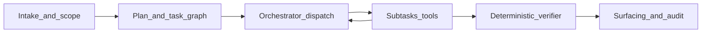

# Gated change-risk architecture (aligned to repo)

## Where you are today

- **Product narrative** in [`idea.md`](idea.md) already matches the “gated analysis + deterministic trust boundary” thesis; the **offline** toolchain (AST/ASG/CPG, diff, path miner, ranker, reasoner) is documented in the README and lives under [`backend/cpg_builder/`](backend/cpg_builder/).
- **Live PR analysis** is orchestrated in [`backend/app/worker/tasks.py`](backend/app/worker/tasks.py): GitHub tarballs → dual [`build_dependency_graph`](backend/app/services/graph_builder.py) → [`compare_commits`](backend/app/services/github_client.py) / changed files → [`run_intelligent_scoring`](backend/app/services/intelligent_scorer.py) → blast radius / cross-repo → **one blob** in [`pr_analyses.summary_json`](supabase/migrations/20250327000000_initial.sql).
- **API surface** today: `POST /v1/repos/{repo_id}/analyze`, `GET .../analyses/{analysis_id}` ([`backend/app/routers/analyses.py`](backend/app/routers/analyses.py)); the analysis UI is a thin summary renderer ([`frontend/app/(dashboard)/repos/[repoId]/analyses/[analysisId]/page.tsx`](<frontend/app/(dashboard)/repos/[repoId]/analyses/[analysisId]/page.tsx>)).

**Gap:** The “agent loop” you want (plan → isolated context → targeted tools → verify → surface) is **not yet first-class** in persistence, HTTP shape, or the worker pipeline. The **heavy graph moat** (CPG + stitcher + verifier) is largely **CLI-side**, not the default web job path.

## Target architecture (conceptual): analysis agent loop

The **gate pipeline is an agent loop** (same mental model as orchestrator-style agent runtimes): message/plan state plus **tool calls** (subtasks) whose results feed the next decision until the orchestrator reaches **surface** or a terminal failure. In the spec doc, refer to **`run_analysis_job`’s replacement** as the **analysis agent loop** — not cosmetic: a **subtask timeout** is a **tool result error**, not an undefined “pipeline crash,” and recovery is defined per subtask.



Map to three **graph products** (logical views over artifacts, not necessarily three separate DB tables on day one):

| Layer             | Role                                                 | Repo anchor                                                                                         |
| ----------------- | ---------------------------------------------------- | --------------------------------------------------------------------------------------------------- |
| Base system graph | Static understanding of head (and base when diffing) | Extend or complement `dependency_snapshots` / graph JSON; long-term CPG exports                     |
| Change graph      | Diff overlay on top of base                          | [`cpg_builder` diff / git diff](backend/cpg_builder/git_diff.py) + summary fields you already stash |
| Risk graph        | Verified/promoted paths only                         | New normalized findings + verifier audit rows                                                       |

## 1. Planning layer (first-class)

**Planner input:** changed files (from existing compare), paths, optional migration/auth/task hints from heuristics.

**Planner output:** structured plan document **plus a task dependency graph** (not only a flat `enabled_analyzers[]`). Nodes = **subtasks** (e.g. `cpg_mining`, `route_extraction`, `schema_extraction`, `path_miner`, `ranker`, `route_binding_verifier`, `schema_reference_verifier`, `surface`). Edges = **dependencies** (parallel branches allowed: e.g. CPG mining and schema extraction independent; both must complete before verifier that needs both; verifiers feed `surface`). Status semantics align with a small task list: `pending`, `in_progress`, `completed`, `failed`, `blocked` (blocked = upstream failed). Persist the graph JSON on **`analysis_plans`** (`task_graph_json` or equivalent). The **orchestrator** reads this graph and dispatches Celery subtasks accordingly — same pattern as task-list coordination in agent runtimes.

**Implementation direction:**

- Add an **`analysis_plans`** table keyed by `run_id` / `analysis_id` with **`task_graph_json`** (required), `reason_json`, `analysis_mode`, `disabled_subtasks` with reasons.
- New module e.g. `backend/app/services/analysis_planner.py` that runs **before** expensive work and **materializes** the task graph from rules + repo/org config; persist immediately.
- **Default glob constants** (additive org overrides only — do not replace defaults):

```text
FRONTEND_STITCH_GLOB_DEFAULT = "frontend/app/**"
BACKEND_ROUTERS_STITCH_GLOB_DEFAULT = "backend/app/routers/**"
```

Expose as named constants in `analysis_planner.py` and document in PRODUCT_SPEC.

**Planner v1 rule procedure (concrete — extend in code + tests):**

Rules are evaluated over **`changed_files`**. **`frontend_backend_stitch`** subtask is enabled only when **both** (a) at least one changed path matches **default or org-additive** `FRONTEND_STITCH_GLOB_DEFAULT` and (b) at least one matches **default or org-additive** `BACKEND_ROUTERS_STITCH_GLOB_DEFAULT`. Otherwise enable only the relevant extraction branch.

| Condition (examples) | Effect |
| ---------------------- | ------ |
| Any path under `supabase/migrations/` or `**/migrations/**/*.sql` | Include `schema_extraction` → `schema_reference_verifier` chain when implemented; reason: `migration_files_changed` |
| Any path matching `backend/**/routers/**`, `**/api/routes/**`, or `**/*router*.py` | Include `route_extraction` → `route_binding_verifier` |
| Both frontend and router globs (above) have changes | Enable `frontend_backend_stitch` path in the task graph |
| Any path matching `**/celery*.py`, `**/tasks.py`, `**/worker/**` | Include async subtasks only if org flag `async_checks_enabled` |
| Any path matching `**/policies/**`, `**/*rls*`, `supabase/**/*.sql` (heuristic) | Set `rls_touched: true` for P4; do not auto-enable RLS verifier in P1 |
| Changed file count ≤ N (config, e.g. 15) and no migration touch | `analysis_mode`: `focused_contract_scan` |
| Else | `analysis_mode`: `standard` or `full` per org caps |

**Disabling:** If stack detection says “no FastAPI” (future), prune `route_*` nodes and record reasons.

**Testing:** `test_analysis_planner.py` — fixed file lists → expected **task graph** shape (nodes + edges) and `reason_json`.

**Planner limitations (must appear in `docs/PRODUCT_SPEC_GATED_ANALYSIS.md`):** v1 uses **file-path heuristics only**. The **file-count threshold** for `focused_contract_scan` vs `standard` is **scope/cost control**, not a risk signal — e.g. a one-line decorator change in a router can be higher risk than a 200-line utility edit; the planner does not distinguish. **`verifier_audits` and feedback from Phase 2+** are the intended training signal for a smarter planner.

## 2. Branch-isolated analysis context

You already isolate via **temp dirs** and tarballs in `tasks.py`. Formalize as a product concept:

- **Artifact naming:** `repo_id`, `base_sha`, `head_sha`, `plan_hash` or `analysis_id` in snapshot keys.
- **Reuse:** [`dependency_snapshots`](supabase/migrations/20250327000000_initial.sql) (and any graph artifact tables you add) should reference commit SHAs and optional “slice type” (full vs focused).

No need to mimic git worktrees in DB unless you add concurrent runs per branch; **temp checkout + SHA** is enough for v1.

## 3. Orchestrator–subagent execution (replaces monolithic Celery task)

**Do not** keep all steps in one long `run_analysis_job` body. **Claude Code–style lesson:** one mega-task = one bloated context, no isolation, hard to parallelize, CPG work becomes a **sync spike** in the worker.

**Shape:**

- **Orchestrator task (thin):** Loads run + `analysis_plans.task_graph_json`, resolves which subtasks are **ready** (dependencies satisfied), **dispatches** separate Celery tasks (or async primitives) per subtask: e.g. `cpg_mining`, `route_extraction`, `schema_extraction`, each **verifier check**, `path_miner`, `ranker`, **`surface`**. Each subtask has its **own timeout, retry budget, and result artifact** (Storage path or small JSON row).
- **Subtasks:** Call into `graph_builder`, `cpg_builder`, extractors, `verifier_service` as appropriate — **never** long synchronous CPG in the orchestrator thread; **dispatch** CPG as an isolated worker with a **bounded** contract (artifact out or structured error).
- **Orchestrator loop:** Collect results → update **task graph state** (stored in `analysis_plans` or `pr_analyses.summary_json` under a stable key like `task_state`) → dispatch next wave → repeat until `surface` completes or terminal failure.

**`current_gate` on `pr_analyses` is obsolete** — replace with **`task_graph_state`** (or equivalent) referencing **which subtask ids** are pending/in_progress/completed/failed/blocked. Retry and attempt logs are **per `task_id`**, not “gate 4.”

**Parallelism:** Example — **CPG mining** and **schema extraction** are independent branches; **route extraction** may run in parallel when the graph says so. Verifiers that depend on multiple artifacts **block** until deps complete.

**CLI:** Offline `cpg_builder` scripts remain the regression harness; web path uses the same libraries inside **subtasks**.

## Failure modes, partial runs, and degraded-mode contract (required for trust)

This must be **specified in the product spec and API**, not left to ad hoc implementation.

**Run outcome (persist on `pr_analyses` — summary only):**

- **`completed_ok`:** All **planned subtasks** in the task graph that were scheduled completed successfully (or were skipped per policy); any surfaced **primary** findings passed the verifier for their declared check set.
- **`completed_degraded`:** The run finished and is auditable, but one or more **subtasks** failed, timed out, or were skipped in a way that limits verification. UI/API show **which `task_id`s** and **why**.
- **`failed`:** Intake/planning/orchestrator cannot proceed (e.g. cannot fetch tarballs, cannot determine `changed_files`, invalid task graph). No verified claims.

**If a subtask fails (e.g. `cpg_mining` timeout):**

- Treat as a **tool error** in the agent loop — orchestrator marks that node **failed/blocked dependents**, does not corrupt the whole run as an unhandled exception.
- **Fail closed** for **primary** findings that **depend** on that subtask’s artifact.
- **Persist** per-subtask: `error_code`, `timeout`, `retry_count`, transient vs terminal.
- **Partial value:** Independent branches (e.g. dependency graph + diff) still produce artifacts with **`provenance`** on findings (see §5b).
- **Withheld:** Candidates needing the failed artifact → **`withheld`** with reason `subtask_unavailable: <task_id>`.
- **Retries:** Bounded per **subtask**; no unbounded auto-retry without user **`rerun`**.

**`analysis_run_events` (resolved — separate table, append-only):**

| Column | Purpose |
| ------ | ------- |
| `run_id` | FK → `pr_analyses.id` |
| `task_id` | Subtask id from task graph (e.g. `cpg_mining`) |
| `event_type` | `started`, `completed`, `failed`, `retried`, `withheld`, … |
| `gate` | Optional legacy label or phase name for human UI (not primary key) |
| `attempt` | Integer, per subtask |
| `error_code` | Nullable |
| `metadata_json` | Structured extras |
| `created_at` | Append-only timestamp |

**Never UPDATE** rows — only INSERT. Concurrent Celery workers can append without row lock fights on `pr_analyses`. **`pr_analyses`** holds **rolling summary**: `outcome`, counters, `plan_id`, optional compact `task_state` snapshot; **full history** = events table.

**Retry and row lifecycle (same run vs new run):**

| Event | `pr_analyses` row | `status` / UI | Task tracking | Audit trail |
| ----- | ----------------- | ------------- | -------------- | ----------- |
| **Bounded auto-retry** (same run) | **Same** `id` | **`running`**; UI may show `retrying` + **`task_id`** | **Same subtask id**, increment **`attempt`** | **`analysis_run_events`** INSERT per attempt |
| **Retries exhausted** | Same row | `completed_degraded` or `failed` | Failed subtask recorded | Full history in events |
| **User `POST .../rerun`** | **New** row; set **`rerun_of_analysis_id`** → prior `pr_analyses.id` (nullable FK, **only** on user-triggered reruns; **null** on originals and auto-retries) | New run `pending` → `running` | Fresh task graph state | Prior run **immutable** |

**Invariant:** Auto-retry never forks a second analysis row; **rerun** always does.

**Audit rule:** Primary findings reference **verifier_audits** + **provenance** + **graph artifact ids** where applicable (§5b). Degraded runs are audit-complete when events + summary state record all subtask outcomes.

## 4. API and UI

**API:** Prefer **repo-scoped** routes consistent with auth and existing patterns, e.g. extend under `/v1/repos/{repo_id}/...`:

- `GET .../analyses/{id}/plan`
- `GET .../analyses/{id}/graph` / `.../artifacts` — return **`graph_artifacts` metadata**; **no** multi-megabyte inline body by default. When the client needs the blob, include a **short-lived signed download URL** (and expiry):

```json
{
  "id": "uuid",
  "kind": "base_cpg",
  "commit_sha": "...",
  "byte_size": 12345678,
  "compression": "gzip",
  "preview_jsonb": { "node_count": 100 },
  "download_url": "https://...",
  "download_url_expires_at": "ISO8601"
}
```

Dashboard uses **`preview_jsonb`** for summaries; full graph UI fetches **`download_url`** only on demand.

- `GET .../analyses/{id}/findings`
- `GET .../analyses/{id}/audit`
- `POST .../analyses/{id}/rerun` / `suppress` / `feedback` (feedback partially exists via [`backend/app/routers/feedback.py`](backend/app/routers/feedback.py))

Add thin **aliases** like `/v1/analysis/{id}` only if you need global IDs and can resolve `repo_id` server-side without ambiguity.

**Frontend:** Evolve the analysis route into **tabs or sections**: PR Risk Overview, System Graph, Finding Review (verified vs withheld with reasons), Plan & Audit. Start by reading structured endpoints instead of one giant `summary_json`.

## 5. Data model (Supabase)

Evolve from monolithic `summary_json` toward normalized tables (your list is sound):

- **`pr_analyses` (analysis runs):** Add `outcome` (enum), `mode`, `plan_id`, counters (`verified_count`, `withheld_count`), optional compact **`task_graph_state`** snapshot; **`rerun_of_analysis_id`** `uuid` **nullable** `references pr_analyses(id)` — **set only on user-triggered reruns**; **null** on original runs and auto-retries. **No `current_gate`** — replaced by task graph state + events.
- **`analysis_plans`:** `run_id`, `plan_type`, **`task_graph_json`** (nodes, edges, deps — source of truth for orchestrator), `reason_json`, `disabled_subtasks` / reasons. Flat `enabled_analyzers` is **derived** from the graph for API convenience, not the only persisted shape.
- **`analysis_run_events`:** Append-only (see failure-modes section); required for audit and concurrent workers.
- **`findings` (single table, explicit lifecycle):** See §5b — include **`provenance jsonb not null default '[]'`** (first-class): e.g. `["dependency_graph","diff"]` or artifact kinds, populated at **surface** so degraded/partial outputs are traceable.
- **`verifier_audits`:** `finding_id`, `checks_run_json`, `passed_checks_json`, `failed_checks_json`, **`graph_artifact_ids uuid[]` or join table** — which **`graph_artifacts.id`**(s) backed each check (audit completeness).
- **`graph_artifacts`:** See §5a — Storage + metadata.

Apply new migrations under [`supabase/migrations/`](supabase/migrations/) with RLS policies mirroring `pr_analyses` (member read via repo org).

### 5a. Graph artifacts: Storage vs jsonb (decide before migration)

Full-repo **CPG/ASG exports can be large**; stuffing them into **`jsonb`** will hit Postgres row size, memory, and PostgREST payload limits — **not viable** as the default for CPG bodies.

**Decision for v1:**

- **Large payloads (CPG JSON, PyG export, full graph ML dumps):** Store in **Supabase Storage** (private bucket). Path convention e.g. `{org_id}/{repo_id}/{analysis_id}/{kind}-{content_hash}.jsonl.gz` or similar.
- **Postgres (`graph_artifacts` table):** Store **metadata only**: `analysis_id`, `repo_id`, `commit_sha`, `kind` (`base_cpg`, `diff_overlay`, …), `storage_bucket`, `object_key`, `content_sha256`, `byte_size`, `compression`, `created_at`. Optional **`preview_jsonb`** only for tiny summaries (node/edge counts) under a strict **size cap** (e.g. 64KB) for SQL-only dashboards.
- **Small artifacts:** If an artifact is provably under cap (e.g. manifest, slice index), **`jsonb` inline** is OK; anything over cap must go to Storage.
- **Query pattern:** SQL lists/filters **metadata**; workers/UI **download** via service role or signed URL when the graph body is needed — never assume `SELECT *` returns megabytes in one query.
- **Latency:** First load = metadata row; cold fetch = Storage GET — acceptable for analysis jobs; cache in worker temp disk as today.

**jsonb-only remains valid** for existing **`dependency_snapshots.graph_json`**-sized graphs if they stay small; **new** CPG pipeline outputs default to Storage + metadata row.

### 5b. Findings lifecycle and FK to `verifier_audits`

**Explicit state machine (one `findings` table):**

1. **Insert** rows as **`candidate`** after mining/ranking (before or as verifier runs per batch).
2. **Verifier** runs on each candidate (or batch): on success → **`verified`** + insert **`verifier_audits`** row FK’d to `findings.id`; on deterministic failure → **`withheld`** + audit optional but recommended with `failed_checks`.
3. **`verifier_audits.finding_id`** always references an **existing** finding row (candidate → final transition in one run). No orphan audits.
4. **Run aborts mid-pipeline** (gate failure before verifier): candidates already inserted → update to **`withheld`** with `withhold_reason: run_aborted_or_gate_failed` (prefer **no hard delete** so audit stays consistent); candidates never created for a failed gate → nothing to clean up.
5. **`superseded` / `dismissed`** for user actions and re-runs.

6. **`provenance`:** Every finding row carries **`provenance jsonb`** (default `[]`), set when the **surface** subtask finalizes the row — e.g. `["dependency_graph","diff"]`, `["cpg_mining","path_miner"]`, so **degraded-mode** partial stories remain **explicitly labeled**. Primary (verified) findings must still satisfy verifier + audit rules.

7. **`verifier_audits` ↔ artifacts:** Each audit record references **`graph_artifact_ids`** (or equivalent) so a primary finding is traceable to **which stored graph blob** (if any) grounded the check — closes audit completeness together with `provenance`.

This implies the **verifier updates rows in place** (status + timestamps), not “only insert verified findings” — document in API so clients expect **`candidate`** rows may exist on internal polls but UI defaults to **`verified`** + **`withheld`** for review.

## 6. Deterministic verifier (trust boundary)

Implement **`verifier_service`** as pure functions over **resolved facts** (route tables, schema from migrations or introspection, RLS metadata where available). Unit-test each check. ML never sets final truth; it only affects ordering and labels upstream of verifier gates.

**Ownership split (avoid conflating planner heuristics with verifier implementations):**

| Concern | Owner | Notes |
| -------- | ------ | ------ |
| **Which** subtasks run and in what dependency order | **`analysis_planner.py`** (and persisted **`task_graph_json`**) | Rules over changed paths, stack detection, org config—**cheap**, iteration-friendly. Wrong graph = wrong tools, but auditable. |
| **Whether** a specific candidate passes deterministic checks | **`verifier_service`** (+ per-check modules, e.g. `verifiers/route_binding.py`) | Each check consumes **structured inputs** produced by graph/schema extractors; heavy lifting lives here or in dedicated parsers used by verifiers. |
| **Extractors** (route registry, SQL migration index, RLS policy parse) | Shared libraries under `app/services/` or `cpg_builder/` | Reused by planner hints and verifier; **not** duplicated ad hoc in the planner. |

The plan file is **not** a substitute for scheduling multi-week verifier work; it only **selects** which checks run. Each check is its own deliverable with tests.

**Rough sizing (order-of-magnitude; adjust per repo conventions):**

| Check / theme | Rough effort | Rationale |
| ---------------- | ------------ | --------- |
| FastAPI route registry + HTTP method/path; caller path alignment | **S–M** | Static scan of decorators/routers is tractable; **L** if heavy dynamic routing. |
| Frontend client → backend route binding (stale path) | **M** | Stitcher + string normalization + verifier; depends on how `fetch` URLs are expressed. |
| Schema entity exists (table/column/RPC name) vs migration/snapshot | **M** | Parse migrations or maintain a migration index; edge cases on views/RPCs. |
| Migration apply **order** vs reference to objects | **M–L** | Needs ordered migration graph + reference resolution. |
| RLS policy **coverage** for an access pattern | **L–XL** | Policy semantics + query analysis; high false-positive/negative risk without scope. |
| Celery producer ↔ consumer + payload shape | **M** | Static task name wiring; **L** if dynamic dispatch. |

**Suggested priority for phased delivery (aligns with Phase 1 MVP):**

1. **P0 — Route / API seam:** Route existence + basic signature alignment (method/path); frontend–backend binding where stitcher exists. Highest ROI for Next + FastAPI; verifier inputs are narrower than RLS.
2. **P1 — Schema reference:** Table/column still present given migration set or declared schema snapshot (start with **positive** checks: “referenced entity exists” before deep migration-order proofs).
3. **P2 — Auth guard on route:** Heuristic (dependency injection / decorator presence)—still deterministic but simpler than RLS proofs.
4. **P3 — Migration ordering / destructive change** vs downstream refs.
5. **P4 — RLS sufficiency** (only after P0–P2 and clear false-positive policy).
6. **P5 — Celery / async contracts** when workers are in scope for the org.

**Planner linkage:** `analysis_planner` should only set `verification_requirements` for checks that are **implemented** (or return a planned check ID with `status: not_implemented` in API until shipped—avoid implying verification that does not exist).

## 7. ML role (unchanged, tighter contracts)

Keep [`ranker.py`](backend/cpg_builder/ranker.py) / GraphCodeBERT as **ranking only**; optional GNN via [`gnn_engine.py`](backend/app/services/gnn_engine.py) for blast enrichment. Enforce at the **surface layer**: only verifier-passed rows become primary findings.

## 8. Roadmap mapping (your phases → repo)

- **Phase 1 (deterministic web MVP):** Planner emits **task graph** + orchestrator/subtasks skeleton + **`analysis_run_events`** + verifier for 2–3 high-value seams + findings (`provenance`) + audits (`graph_artifact_ids`) + dashboard + **PRODUCT_SPEC**. CPG via **subtask**, not monolithic inline call.
- **Phase 2:** Full GraphCodeBERT path ranking in the job; triage UI; training data from `verifier_audits` + feedback.
- **Phase 3:** Org GNN / calibration ([`model_artifacts`](supabase/migrations/20250415000001_ml_stack.sql) already exists).
- **Phase 4:** GitHub status checks / comments ([`webhooks`](backend/app/routers/webhooks.py) already present)—wire to verified findings only.

## 9. Canonical product spec doc (Phase 1 blocking)

The plan is a **decision record**; it is not a substitute for a **single handoff artifact**. Before implementation work that touches migrations or workers, add **`docs/PRODUCT_SPEC_GATED_ANALYSIS.md`** (or one agreed path) that is the **complete** contract:

- **Analysis agent loop** naming; mapping **subtasks** to “tool calls” and failure semantics.
- **Orchestrator + Celery subtasks** topology; per-subtask timeout/retry; no monolithic long task.
- **`task_graph_json`** schema on `analysis_plans` and orchestrator dispatch rules.
- **`analysis_run_events`** full column list; append-only policy; relationship to **`pr_analyses`** summary.
- Run outcomes, degraded mode, **`rerun_of_analysis_id`** rules.
- **`graph_artifacts`** Storage + metadata; **`GET .../graph`** response including **`download_url`** / **`download_url_expires_at`**.
- **`findings`** state machine, **`provenance`**, **`verifier_audits`** + **`graph_artifact_ids`**.
- Planner v1 rules + **default glob constants**; **Planner limitations** subsection (verbatim per §1).
- Public API routes and response shapes for plan, findings, audit, graph.

[`idea.md`](idea.md) stays narrative; the spec doc is for **implementers and Phase 1 handoff** without a verbal briefing. Updating the spec when the contract changes is part of the definition of done.

## Summary

The revised direction is **consistent with the repo’s strengths** (graph/CPG offline stack, FastAPI + Celery + Supabase, blast radius and ML hooks). The **main build work** is: **planner + gated orchestration + verifier service + normalized persistence + API/UI for plan and audit**, and **incremental bridging** of [`cpg_builder`](backend/cpg_builder/) into the web worker so the moat is exercised on every run, not only in CLI artifacts.

**Added constraints:** **Degraded-mode behavior** (`completed_ok` vs `completed_degraded` vs `failed`), bounded retries, and “fail closed for verified claims when a gate fails” are part of the contract, not implementation detail. **Verifier work** is split between **planner selection** and **per-check implementation** with **P0–P5 priority** and rough **S/M/L sizing** so the checklist does not pretend every check is a day’s work.

**This revision also pins:** **Storage-backed large graph artifacts** with metadata in Postgres; **planner v1 rule table** + tests; **retry = same row + attempt log**, **user rerun = new row**; **findings lifecycle** (`candidate` → `verified` / `withheld`) with verifier updating rows in place; **canonical spec doc** as a **Phase 1 blocking** deliverable.

**Orchestrator / agent-loop revision:** Execution is framed as an **analysis agent loop**; **orchestrator + isolated subtasks** replace the monolithic worker; **`analysis_plans.task_graph_json`** drives dispatch and dependencies; **`analysis_run_events`** is the append-only audit log ( **`pr_analyses.current_gate` removed** ); planner emits a **task graph**, not only a flat analyzer list; **`GET /graph`** returns metadata + **signed URL**; **default stitch globs** pinned; **`rerun_of_analysis_id`**, **`findings.provenance`**, and **`verifier_audits.graph_artifact_ids`** close the audit story; **planner limitations** are mandatory in PRODUCT_SPEC.
