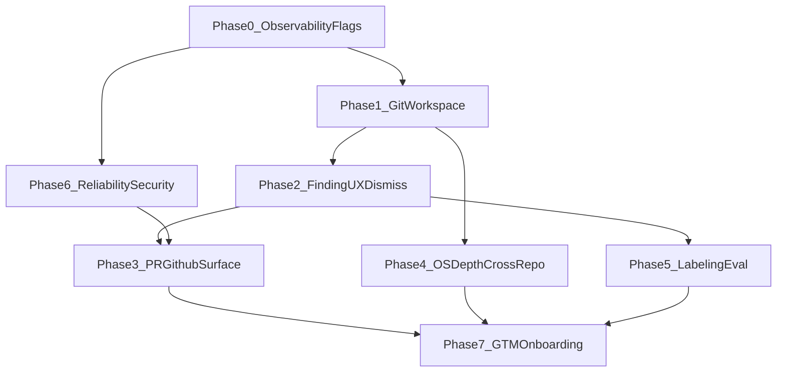

# Production-ready Dependency Map: full program plan

## Reality check (so expectations match engineering)

Delivering **everything** below to true production quality is **several months of focused work** for a small team (often 3–6+ months), not one or two prompts. This plan is written so you can execute **phase by phase**, ship incrementally, and still end with a **defensible prod** app.

**Definition of “prod ready” for this product (target bar)**

- **Correctness:** Hosted analysis uses **real base/head semantics** (git or equivalent), not only filename heuristics, for CPG-critical paths; failures are explicit in UI and `summary_json`.
- **Trust:** Every surfaced finding has a **human-readable explanation**, **witness path**, and **verifier outcome**; users can **dismiss/suppress** with audit trail.
- **Workflow:** Developers see results **on the PR** (GitHub Check or comment) and can open a **stable deep link** in your app.
- **Reliability:** Retries, idempotency, rate limits, queue backpressure, and **observable** pipelines (logs/metrics/traces).
- **Security:** RLS and service-role usage reviewed; **secrets** and **tenant isolation** validated; abuse limits per org.
- **Operability:** Runbooks, env docs, migrations, backups, and **staging** parity.

---

## Phase 0 — Program foundations (1–2 weeks)

**Goals:** Instrumentation, feature flags, and release discipline so later phases do not regress.

| Work item | Detail | Primary touchpoints |
|-----------|--------|---------------------|
| **Feature flags** | Centralize product flags (`cpg_contract_analysis` already in org settings; add server flags for GitHub checks, labeling UI, clone-based diff) in [backend/app/config.py](backend/app/config.py) + org `settings` JSON contract documented in [docs/ARCHITECTURE.md](docs/ARCHITECTURE.md). | Config, docs |
| **Structured logging** | JSON logs with `analysis_id`, `org_id`, `repo_id`, `task_id`, `duration_ms`, `github_request_id` on worker paths in [backend/app/worker/tasks.py](backend/app/worker/tasks.py) and [backend/app/worker/cross_repo_tasks.py](backend/app/worker/cross_repo_tasks.py). | Workers |
| **Metrics hooks** | Counters/histograms for `analysis_started|completed|failed`, `github_429`, `cpg_mining_seconds` (OpenTelemetry or statsd-style; pick one and stay consistent). | `app/main.py`, worker entry |
| **CI gates** | Keep `ruff`, `pytest`, frontend lint/build; add **contract tests** for critical API shapes (`/v1/repos/.../analyses/...`). | [.github/workflows/ci.yml](.github/workflows/ci.yml) |
| **Staging environment** | Supabase project + GitHub App **staging** installation; document env matrix in README. | Docs only |

**Exit criteria:** You can answer “what failed?” for any analysis ID from logs alone.

---

## Phase 1 — Trust and correctness: git-accurate analysis on workers (2–4 weeks)

**Problem today:** Tarball checkouts often lack `.git`; synthetic diff from [backend/cpg_builder/synthetic_diff.py](backend/cpg_builder/synthetic_diff.py) improves seeding but is **not** full graph diff parity with [backend/cpg_builder/git_diff.py](backend/cpg_builder/git_diff.py) + dual `build_cpg` in [backend/cpg_builder/scorer.py](backend/cpg_builder/scorer.py).

### 1A. Shallow clone or fetch workspace (recommended core)

- **New service module** e.g. `backend/app/services/git_workspace.py`:
  - Given `installation_token`, `full_name`, `base_sha`, `head_sha`, materialize a directory under the existing temp root in [backend/app/worker/tasks.py](backend/app/worker/tasks.py) (`TemporaryDirectory` flow in `_run_analysis_orchestrator`).
  - Strategy (pick one and document):
    - **Clone + fetch:** `git clone --filter=blob:none` (partial clone) or shallow clone with enough depth to include both SHAs; `git fetch` until both refs exist; use that path as `repo_root` for `score_repository(..., base=, head=)`.
    - **Alternatives:** bare mirror + worktree (faster for repeated analyses of same repo in warm cache—later optimization).
  - **Security:** Use `x-access-token` style HTTPS URL; never log token; redact URLs in errors.
  - **Timeouts and disk caps:** max clone time, max repo size, cleanup in `finally`.

### 1B. Wire `_task_cpg_mining` to prefer git workspace

- Extend [backend/app/worker/tasks.py](backend/app/worker/tasks.py) `_task_cpg_mining` to call the git workspace helper **when** org setting (e.g. `cpg_use_git_workspace: true`, default true for paid tier later) and GitHub is configured.
- Preserve **fallback order:** git workspace → existing `.git` in tarball → synthetic `changed_files` (current behavior).

### 1C. Verification parity

- Align **which invariants** run in hosted mode with what [backend/cpg_builder/invariants.py](backend/cpg_builder/invariants.py) + [backend/app/services/analysis_planner.py](backend/app/services/analysis_planner.py) intend; add explicit matrix in docs (table: invariant ID, trigger, hosted on/off).
- Add **golden-repo integration tests** under `backend/tests/integration/` using a tiny fixture repo **with** `.git` created in fixture setup, asserting `diff_payload` is non-null and candidate counts match expectations.

**Exit criteria:** For a real GitHub PR, hosted `score_repository` path uses **git base/head** and produces graph-diff-shaped payloads equivalent to local CLI for the same SHAs on representative repos.

---

## Phase 2 — Finding quality and noise control (2–3 weeks)

**Schema already supports dismissal:** [supabase/migrations/20260417000000_gated_analysis.sql](supabase/migrations/20260417000000_gated_analysis.sql) `findings.status` includes `dismissed`, `superseded`.

### 2A. Human-facing finding detail model

- **Backend:** Add serializer or view-model builder that maps `findings.candidate_json`, `verification_json`, `reasoner_json`, and linked `verifier_audits` into a stable DTO: `title`, `severity`, `invariant_id`, `witness_nodes`, `file_anchors[]`, `verdict`, `caveats[]`, `evidence_links[]`.
- **Implementation home:** New module e.g. `backend/app/services/finding_presenter.py`; used by [backend/app/routers/analyses.py](backend/app/routers/analyses.py) `get_analysis_findings` (extend response) or new `GET .../findings/{id}`.

### 2B. Dismiss / suppress / baseline

- **API:** `PATCH /v1/repos/{repo_id}/findings/{finding_id}` with `{ "status": "dismissed", "reason": "..." }` (role-gated: org admin or repo maintainer—define role in `organization_members.role`).
- **Suppression rules (v1):** JSON in `organizations.settings`, e.g. `finding_suppressions: [{ invariant_id, path_glob, expires_at }]`, evaluated in worker before `persist_findings_and_audits` in [backend/app/services/analysis_runs.py](backend/app/services/analysis_runs.py) or immediately after candidate generation.
- **Baseline / supersede:** On re-analysis, mark prior `verified` findings as `superseded` when same `finding_key` and new verdict differs (requires deterministic `finding_key` policy—audit [persist_findings_and_audits](backend/app/services/analysis_runs.py)).

### 2C. UI

- Replace raw JSON-first UX on [frontend/app/(dashboard)/repos/[repoId]/analyses/[analysisId]/page.tsx](frontend/app/(dashboard)/repos/[repoId]/analyses/[analysisId]/page.tsx) with **FindingCard** components: verdict, path chips, expandable technical detail.
- Add **Dismiss** action with confirmation and reason (calls new API).

**Exit criteria:** A reviewer can understand and action a finding in **under 60 seconds** without reading raw JSON.

---

## Phase 3 — PR-native product surface (3–5 weeks)

### 3A. Data model and API for PR as first-class

- **DB:** Ensure `pr_analyses` has or add nullable `github_pr_number`, `github_pr_url`, `installation_id` snapshot if missing—audit [supabase/migrations/20250327000000_initial.sql](supabase/migrations/20250327000000_initial.sql) and gated migration.
- **API:** `GET /v1/repos/{repo_id}/pulls/{pr_number}/analyses` or query param filter on list endpoint; stable ordering by `created_at`.
- **Worker:** When webhook creates analysis ([backend/app/routers/webhooks.py](backend/app/routers/webhooks.py)), always persist PR metadata on `pr_analyses`.

### 3B. Frontend PR hub

- New route e.g. `frontend/app/(dashboard)/repos/[repoId]/pulls/[prNumber]/page.tsx` (or embed on repo page): timeline of analyses, latest summary rollup, link to analysis detail.
- Replace “latest analysis JSON dump” on [frontend/app/(dashboard)/repos/[repoId]/page.tsx](frontend/app/(dashboard)/repos/[repoId]/page.tsx) with structured cards.

### 3C. GitHub feedback (high impact)

- **GitHub Check Runs API** (preferred for enterprise tone): create/update check from worker when analysis starts/completes; conclusion `neutral|success|failure` mapped from `outcome` and severity (document policy—avoid false “failure” if product is advisory).
- **PR comment fallback** (simpler MVP): post/update a single comment with summary + link to app.
- **Implementation:** New `backend/app/services/github_checks.py` using existing token helpers in [backend/app/services/github_client.py](backend/app/services/github_client.py); call from end of `_run_analysis_orchestrator` or Celery task to avoid blocking HTTP response.
- **Idempotency:** Store `github_check_run_id` or `github_comment_id` on `pr_analyses` (migration) to update in place.

**Exit criteria:** Opening a GitHub PR shows **check or comment** within SLA; clicking lands in your app on the correct analysis.

---

## Phase 4 — “Dependency Map OS” depth (4–8 weeks, parallelizable)

### 4A. Stitcher and stack coverage

- Expand [backend/cpg_builder/stitcher.py](backend/cpg_builder/stitcher.py) / planner globs for **Next.js app router**, **Remix**, **generic OpenAPI** imports—not only current monolith assumptions in [backend/app/services/analysis_planner.py](backend/app/services/analysis_planner.py).
- **Coverage metrics** already partially surfaced via `stitch_overview`; promote to **org-level dashboard** (Phase 6) and gate “low coverage” findings in UI.

### 4B. Branch and migration intelligence (productized)

- Use existing drift plumbing ([backend/app/services/branch_monitor.py](backend/app/services/branch_monitor.py), [backend/app/worker/cross_repo_tasks.py](backend/app/worker/cross_repo_tasks.py), [backend/app/routers/branches.py](backend/app/routers/branches.py)) to ship:
  - **UI:** “Schema on branch A vs B” summary, not only API JSON.
  - **Worker:** Tie migration-changed findings to **branch default** snapshots in `dependency_snapshots` / `ast_graph_snapshots`.

### 4C. Cross-repo blast as a product

- Expose `cross_repo_impacts` from [backend/app/services/blast_radius.py](backend/app/services/blast_radius.py) / `summary_json` in a **dedicated UI** section and org-level **consumer graph** explorer backed by [backend/app/routers/cross_repo.py](backend/app/routers/cross_repo.py).
- **Beat schedules** and rate limits already touched in architecture; add **admin UI** for org caps (`max_consumer_repos`, etc.) stored in `organizations.settings`.

**Exit criteria:** A lead engineer can answer “**what breaks outside this repo?**” from the UI in one screen.

---

## Phase 5 — Data and model flywheel (3–6 weeks)

### 5A. In-product labeling

- **DB:** Extend `review_feedback` usage in ML stack ([supabase/migrations/20250415000001_ml_stack.sql](supabase/migrations/20250415000001_ml_stack.sql)) or add `finding_reviews` table keyed by `finding_id` with `label` (`helpful|wrong|noisy`), `notes`, `user_id`.
- **API:** POST from UI; enforce org membership via [backend/app/deps.py](backend/app/deps.py).
- **Export:** Reuse [backend/cpg_builder/prepare_graphcodebert_dataset.py](backend/cpg_builder/prepare_graphcodebert_dataset.py) pipeline by periodic job exporting labeled rows to `artifacts/` or S3-compatible storage (org-scoped).

### 5B. Continuous eval dashboard

- Aggregate from stored labels + `verifier_audits` + ranker metadata (`rank_phase`, `rank_score` on findings).
- **Frontend:** New org admin page under `frontend/app/(dashboard)/orgs/[orgId]/...` with charts (precision proxy, volume, top invariants).
- **Backend:** Materialized aggregates optional (nightly job) vs on-demand SQL.

### 5C. Hosted reasoner economics (if you keep Gemma/hosted path)

- **Config per org:** monthly token budget, max packs per run in [backend/cpg_builder/scorer.py](backend/cpg_builder/scorer.py) / [backend/cpg_builder/reasoner.py](backend/cpg_builder/reasoner.py).
- **Queue discipline:** Separate queue priorities; stale-run cancellation.

**Exit criteria:** You can show investors a **chart** of label quality improving week over week (even if model is not fine-tuned yet).

---

## Phase 6 — Reliability, cost, multi-tenant security (3–6 weeks, ongoing)

### 6A. Idempotency and webhooks

- Harden [backend/app/routers/webhooks.py](backend/app/routers/webhooks.py): delivery dedupe keys (`X-GitHub-Delivery`), signature verification already present—add replay protection window.
- Ensure `pr_analyses` insert for same `(repo_id, pr_number, head_sha)` **updates or dedupes** intentionally (define semantics: one row per push vs history—document and test).

### 6B. Rate limits and backpressure

- Extend [backend/app/services/github_client.py](backend/app/services/github_client.py) patterns to all new GitHub APIs (checks, comments).
- Celery queue routing: isolate long CPG jobs on dedicated queue with concurrency cap ([backend/app/celery_app.py](backend/app/celery_app.py)).

### 6C. Security review pass

- Audit every route in `backend/app/routers/` for **org/repo scoping** (pattern already in [backend/app/routers/analyses.py](backend/app/routers/analyses.py)).
- RLS: verify policies on `findings`, `graph_artifacts`, `analysis_plans`, `review_feedback` match product roles.
- **Secrets:** `.env.example` vs production secret rotation story; GitHub App key rotation runbook.

### 6D. SLOs

- Publish internal SLO: e.g. p95 analysis &lt; 5 min for “standard” mode on median repo; track in metrics from Phase 0.

**Exit criteria:** Load test on representative repos without exhausting GitHub quota or Redis memory; no cross-org data leaks in automated security tests.

---

## Phase 7 — GTM and “proper app” polish (2–4 weeks, parallel with Phase 3–4)

- **Marketing site / README hero:** One clear sentence: **pre-merge contract verification**, not generic graphs.
- **Demo repo:** Public repo with intentional contract bugs + “Run Dependency Map” instructions; CI badge optional.
- **Case study template:** Before/after: invariant, witness path, verifier, time saved.
- **Onboarding wizard:** In-app checklist: install GitHub App, select repos, set `cpg_contract_analysis`, run test PR.

---

## Dependency graph (high level)

---

## Execution guidance (how to use this plan across “a few more prompts”)

1. **Lock scope per prompt:** e.g. “Implement Phase 1A–1C only” or “Phase 3C GitHub checks only.”
2. **Ship vertically:** each phase should end with something **users can see** (UI or GitHub), not only backend refactors.
3. **Maintain a decision log:** extend [decision-log.md](decision-log.md) with ADR-style entries for GitHub Check conclusion policy, dismissal semantics, and dedupe rules.

---

## Honest scope note

“**100%**” of this document is a **full product + platform program**. Completing it all is what makes you proud **as a company trajectory**, not as a single burst of codegen. The sequencing above is designed so **each phase** still moves you toward prod-ready without blocking on the entire vision.
